# CLion for STM32

## 前言

### 缘起

笔者在学习和实际开发 STM32 的时候，一直使用 Keil 作为 IDE。但是，众所周知，Keil 以其上世纪的 UI、极其卡顿的智能补全以及不能跨平台等缺点，一直饱受诟病。不过不得不承认，Keil 本身的功能十分强大，尤其是其调试能力十分出色。

自从学习 FreeRTOS 之后，笔者发现 Keil 似乎不能很好地调试 FreeRTOS 等一众 RTOS。

> 可能是笔者不会用 Keil 调试 FreeRTOS，如果有大佬知道如何调试，希望大佬不吝赐教！

后来偶然间读到大佬[**稚晖君**](https://space.bilibili.com/20259914?spm_id_from=333.337.0.0)的：[配置CLion用于STM32开发【优雅の嵌入式开发】](https://zhuanlan.zhihu.com/p/145801160)，再加之一直听说 Jetbrains 家的 IDE 功能强大、UI 美观，遂萌生了更换开发环境的想法。

但是当笔者实际操作时发现，稚晖君大佬的这套方案是他于 2022 年写的，而如今已经 2025 年了，稚晖君使用的 MinGW 也早就停止维护了，虽然有可替代的 MinGW-w64，但考虑到**跨平台**、**易用性**以及**易迁移性**，笔者最终选择了 STM32CubeCLT 系列工具重新配置 CLion 的开发环境。

> [!note]
>
> 关于 MinGW 和 MinGW-w64 的区别可以查看这篇文章：[【科普】【FAQ】MinGW vs MinGW-W64 及其它](https://github.com/FrankHB/pl-docs/blob/master/zh-CN/mingw-vs-mingw-v64.md)

> 如果有谁知道这篇文章的原文出处，欢迎告知！

以上便是这篇教程的由来。

### 笔者环境

| 条目         | 版本                                         |
| ------------ | -------------------------------------------- |
| 操作系统     | Windows 11 专业版 24H2 26100.3915            |
| CLion        | CLion 2025.1 CL-251.23774.442 April 15, 2025 |
| STM32CubeCLT | Win 1.18.0                                   |
| STM32CubeMX  | MX.6.14.1                                    |
| OpenOCD      | 20240916                                     |

## 简介

本教程为将 CLion 配置成开发 STM32 IDE 详细步骤，通过本教程，你可以学习到如下知识：

+ 配置 OpenOCD 烧录下载代码
+ 配置 ST-LINK 调试代码
+ 将 MINI ST-LINK V2 转为 ST-LINK
+ 配置 J-LINK 调试代码

## 需求分析

开发 STM32 项目的一般流程如下图所示：

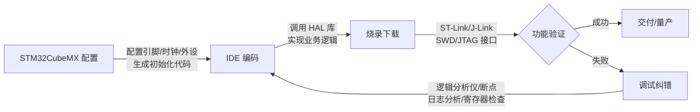

可以将这个流程总体归纳为四个步骤：

1. STM32CubeMX 配置
2. IDE 编码
3. 烧录下载
4. 调试纠错

每一个步骤都有相应的软件支持，但我们真正需要的正是一个将这些所有功能集成到一起的 IDE，这样才能简化我们的开发流程。由于 CLion 已经集成了 STM32CubeMX，同时 CLion 本身就是编写代码的 IDE，所以本教程着重从**烧录下载**和**调试纠错**两个方面对 CLion 配置进行讲解。

## 软件下载安装

这里仅给出所需软件的官方下载链接：

+ CLion：[https://www.jetbrains.com/clion/download/#section=windows](https://www.jetbrains.com/clion/download/#section=windows)
+ STM32CubeMX：[https://www.st.com/en/development-tools/stm32cubemx.html](https://www.st.com/en/development-tools/stm32cubemx.html)
+ STM32CubeCLT：[https://www.st.com/en/development-tools/stm32cubeclt.html](https://www.st.com/en/development-tools/stm32cubeclt.html)
+ OpenOCD：[https://gnutoolchains.com/arm-eabi/openocd/](https://gnutoolchains.com/arm-eabi/openocd/)

请读者自行下载安装。

> [!warning]
>
> 所有软件的安装路径不要出现中文。除 CLion 外，其余软件安装路径不能出现中文、空格以及特殊符号。
>
> 因为 CLion 是通过命令行的方式调用其他工具，所以如果路径中出现了中文、空格以及特殊符号，就会导致命令出错。

在这里列出笔者所装软件的路径，以供读者参考：

+ CLion：`D:\Program Files\JetBrains\CLion 2024.3.4`
+ STM32CubeMX：`D:\AppData\Local\Programs\STM32CubeMX`
+ STM32CubeCLT：`D:\ProgramData\ST\STM32CubeCLT`
+ OpenOCD：`D:\ProgramData\OpenOCD`

> [!note]
>
> 注意：笔者这里 CLion 的安装路径虽然是 `CLion 2024.3.4`，这并不意味着笔者使用的是 2024.3.4 版本的 CLion，这只是因为笔者第一次安装 CLion 的时候 CLion 的版本是 2024.3.4。笔者在使用软件的过程中，对软件进行了更新，现在是最新版的。

## 编译烧录

### 编译

CLion 集成的是面向 `x86`/`x64` 体系架构的原生 Windows 编译器（如 MinGW 的 `gcc`/`g++` 或 MSVC），这类编译器主要用于生成运行在基于 `x86` 或 `x86_64` 架构的普通 Windows 应用程序。

而 STM32 是基于 Arm Cortex-M 系列处理器（ARMv6/ARMv7/ARMv8-M 架构）的嵌入式设备，其程序需通过 ARM 交叉工具链（如 `arm-none-eabi-gcc`）编译成 ARM 指令集的机器码。

> [!note]
>
> **交叉编译**是指在某个系统平台下产生另一个系统平台的可执行文件的过程。
>
> 如果你想要了解更多关于交叉编译的信息，可以访问：[Cross compiler](https://en.wikipedia.org/wiki/Cross_compiler)。

二者的指令集不同，因此必须针对目标硬件平台配置专用的交叉编译工具链才能完成编译。

在安装的 STM32CubeCLT 工具中，已经包含了 `arm-none-eabi-` 系列交叉工具，如下图所示：

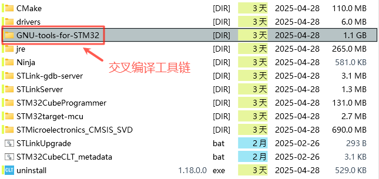

接下来需要做的便是在 CLion 中集成这个交叉编译工具链。

打开 CLion，按照如下路径访问：设置 $\rightarrow$ 构建、执行、部署 $\rightarrow$ 工具链，如下图所示

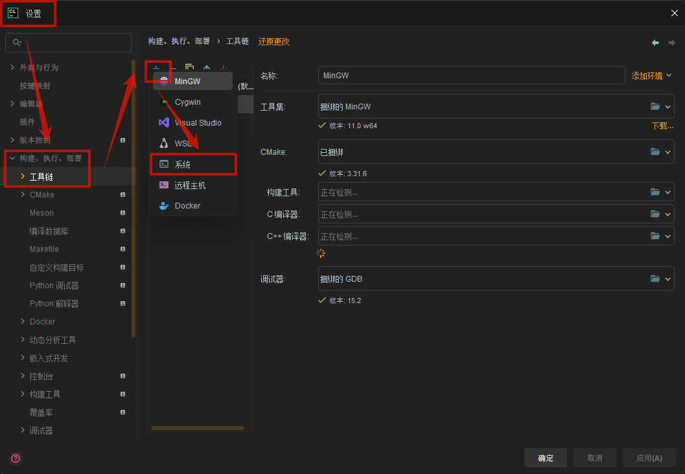

点击加号 `+` 新建工具链配置，选择**系统**，按照要求进行配置，如下图所示：

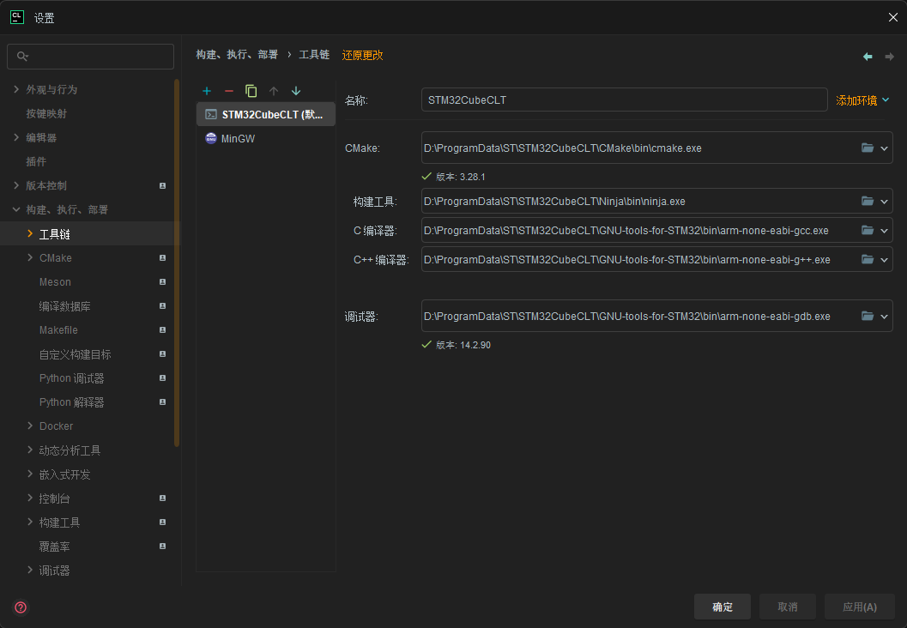

这里列出笔者的配置（与上图一致，方便读者阅读和复制）,供大家参考：

+ 名称：STM32CubeCLT
+ CMake：`D:\ProgramData\ST\STM32CubeCLT\CMake\bin\cmake.exe`
+ 构建工具：`D:\ProgramData\ST\STM32CubeCLT\Ninja\bin\ninja.exe`
+ C 编译器：`D:\ProgramData\ST\STM32CubeCLT\GNU-tools-for-STM32\bin\arm-none-eabi-gcc.exe`
+ C++ 编译器：`D:\ProgramData\ST\STM32CubeCLT\GNU-tools-for-STM32\bin\arm-none-eabi-g++.exe`
+ 调试器：`D:\ProgramData\ST\STM32CubeCLT\GNU-tools-for-STM32\bin\arm-none-eabi-gdb.exe`

> [!note]
>
> 工具链配置中，最顶端的配置即为默认配置，笔者主要使用 CLion 开发 STM32 项目，所以将 STM32CubeCLT 配置放在了最顶端作为默认配置。

#### 编译测试

配置完成后，使用 CLion 打开演示例程 [`demo/103c8t6_led_blink`](./demo/103c8t6_led_blink) 进行编译，编译成功的输出如下所示：

```shell
====================[ 构建 | 103c8t6_led_blink | Debug ]==========================
D:\ProgramData\ST\STM32CubeCLT\CMake\bin\cmake.exe --build E:\Downloads\GitRepo\Github\Others\clion_for_stm32\demo\103c8t6_led_blink\cmake-build-debug --target 103c8t6_led_blink -j 14
[1/34] Building C object CMakeFiles/103c8t6_led_blink.dir/Core/Src/main.c.obj
...
[34/34] Linking C executable 103c8t6_led_blink.elf
D:/ProgramData/ST/STM32CubeCLT/GNU-tools-for-STM32/bin/../lib/gcc/arm-none-eabi/13.3.1/../../../../arm-none-eabi/bin/ld.exe: warning: 103c8t6_led_blink.elf has a LOAD segment with RWX permissions
Memory region         Used Size  Region Size  %age Used
             RAM:       14584 B        20 KB     71.21%
           FLASH:       18124 B        64 KB     27.66%

构建 已完成
```

这里笔者为了方便读者阅读，省略了中间大段的编译信息。

如果读者编译失败，欢迎提出 [Issue](https://github.com/bfmhno3/clion_for_stm32/issues)，笔者会及时跟进解决。

### 烧录

在完成代码的编译后，接下来的关键步骤就是将生成的可执行文件（如 `.hex`、`bin` 或 `.elf`）烧录到 STM32 芯片的 Flash 存储器中。与传统嵌入式 IDE（如 Keil）不同，CLion 本身并不直接集成烧录功能，而是通过外部工具（如 OpenOCD、STM32CubeProgrammer 或 JLlinkGDBServer）实现烧录。

笔者将对这三种工具的配置进行讲解，读者可自行尝试，然后根据自己的需求选择对应的烧录方式。

#### OpenOCD

CLion 内部集成了 OpenOCD，但并没有捆绑安装 OpenOCD，所以需要先配置 OpenOCD 的安装路径。

按照如下路径进行访问：设置 $\rightarrow$ 构建、执行、部署 $\rightarrow$ 嵌入式开发，如下图所示：

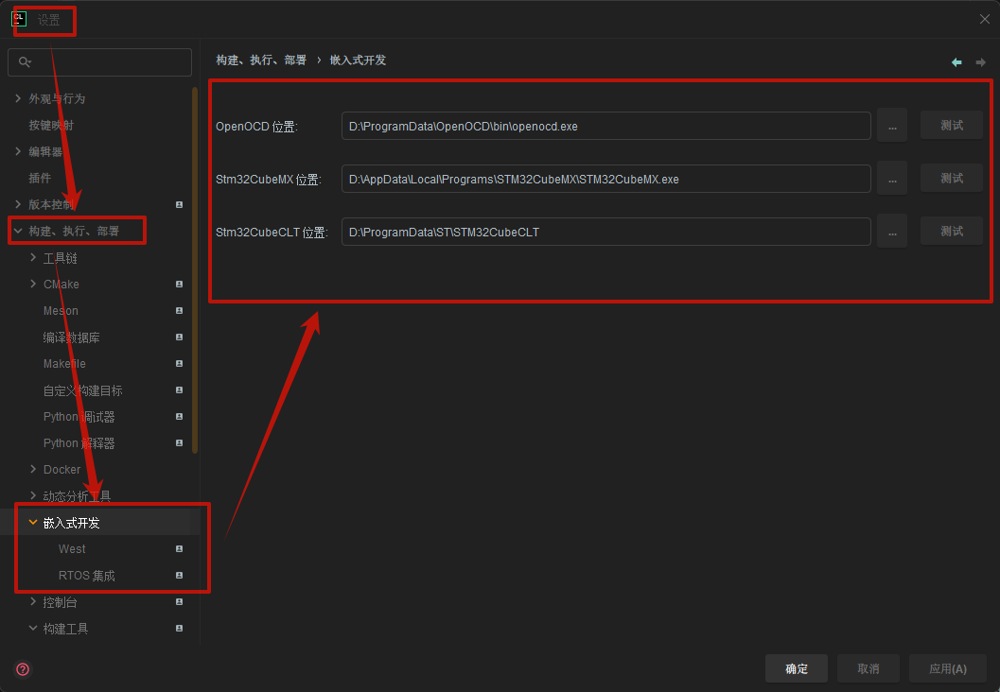

这里有三个选项需要配置，本来只需要配置 OpenOCD 位置，不过既然已经来到了这个页面，不妨将这三个选项一起配置。这里列出笔者配置，以供读者参考：

+ OpenOCD 位置：`D:\ProgramData\OpenOCD\bin\openocd.exe`
+ Stm32CubeMX 位置：`D:\AppData\Local\Programs\STM32CubeMX\STM32CubeMX.exe`
+ Stm32CubeCLT 位置：`D:\ProgramData\ST\STM32CubeCLT`

其中，配置 STM32CubeMX 是因为 CLion 在 右键菜单中集成了 STM32CubeMX（右键 `103c8t6_led_blink.ioc` 即可看到），如下图所示。所以需要告诉 CLion STM32CubeMX 的可执行文件的位置。如果配置完成后，发现 `通过 STM32CubeMX 打开` 按钮是灰色的，请重启 CLion 再次尝试。

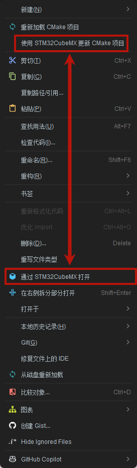

回归正题，配置完 OpenOCD 路径之后，便可配置 OpenOCD 调试配置。

按照以下路径访问：运行 $\rightarrow$ 编辑配置 $\rightarrow$ 点击加号 `+` 新建配置 $\rightarrow$ 选择 **OpenOCD 下载并运行**，操作过程如下 GIF 所示：


详细配置如下所示：

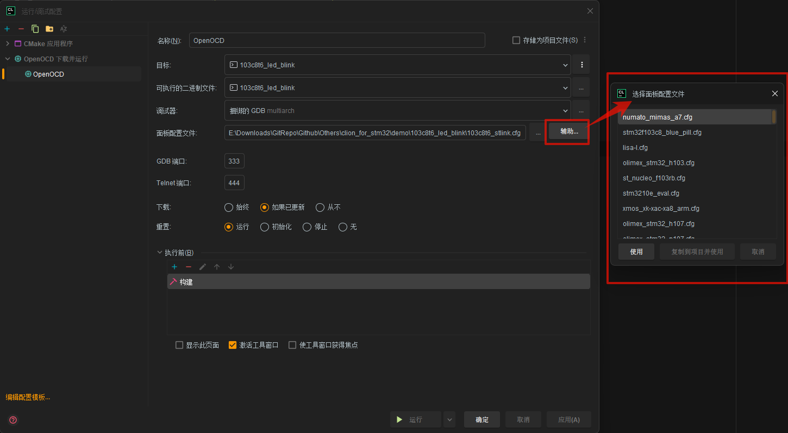

配置时需要一个**面板配置文件**，这个面板配置文件就是告诉 OpenOCD 一些基础信息，比如使用了什么烧录器、目标芯片是什么型号、传输速率是多少等。可以点击**辅助**选项，查找 CLion 有没有内置你所使用的目标芯片的配置，如果没有就需要手动编写。

关于 OpenOCD 的配置文件详细信息可以参考：[OpenOCD User’s Guide](https://openocd.org/doc/html/index.html)。

#### STM32CubeProgrammer

STM32CubeProgrammer 是 ST 官方提供的跨平台烧录工具（支持 Windows 和 Linux）。

这也是笔者推荐的烧录方式。

细心的读者可能已经发现了，在之前安装的 STM32CubeCLT 中已经包含了 STM32CubeProgrammer，这种集成的方式非常有利于跨平台开发。

按照我们之前的思路，我们首先要做的应该是在 CLion 中配置 STM32CubeProgrammer 的路径，但是，如果有读者自行尝试过的话，应该会发现找不到相关的配置选项，这是因为 CLion 对于 STM32CubeCLT 的集成是最新发布的实验性功能，详情可参考 [What's New in CLion 2025.1](https://www.jetbrains.com/clion/whatsnew/)。

> [!important]
>
> 如果你想要使用 STM32CubeProgrammer 进行烧录，那么请务必更新到最新版本（2025.1）。

按照以下路径访问：设置 $\rightarrow$ 高级设置 $\rightarrow$ 调试器 $\rightarrow$ 勾选**启用调试服务器**，如下图所示：

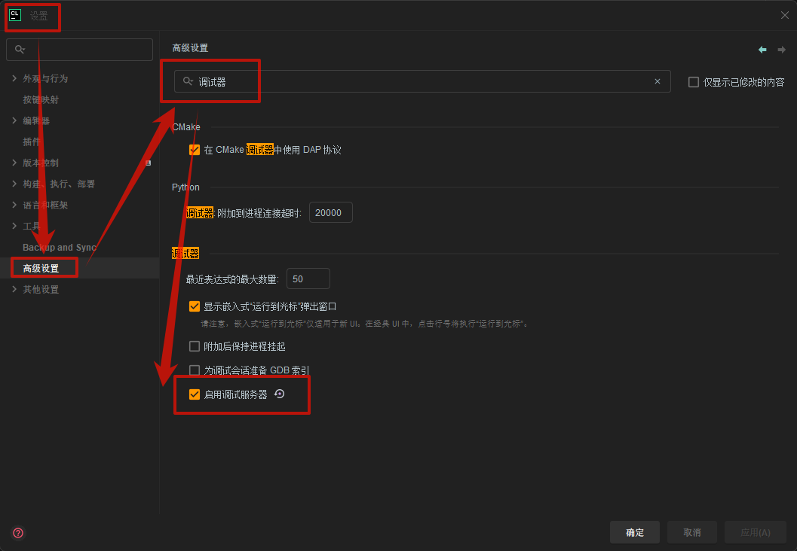

然后按照以下路径访问：设置 $\rightarrow$ 构建、执行、部署 $\rightarrow$ 调试器 $\rightarrow$ 调试服务器，如下图所示：

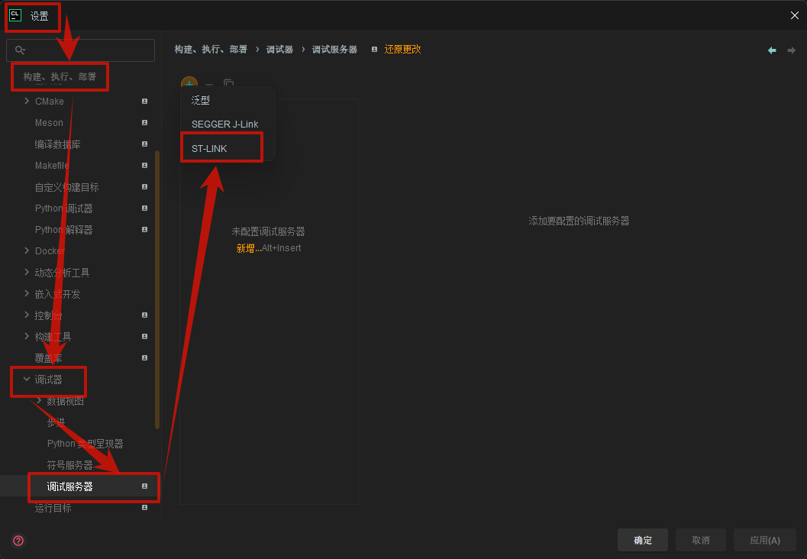

点击加号 `+` 新建配置，选择 `ST-LINK`，则可以配置 STM32CubeProgrammer 的路径，即这里显示的**程序员**，同时需要配置上面的 ST-LINK GDB 服务器的路径，这也包含在 STM32CubeCLT 中。如下图所示：

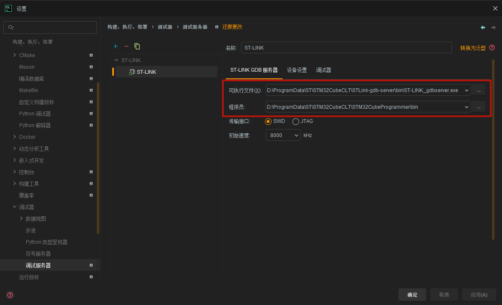

这里列出笔者的配置，供大家参考：

+ 可执行文件：`D:\ProgramData\ST\STM32CubeCLT\STLink-gdb-server\bin\ST-LINK_gdbserver.exe`
+ 程序员：`D:\ProgramData\ST\STM32CubeCLT\STM32CubeProgrammer\bin`

> 这里的**程序员**应该是翻译错误，正常情况下应该显示 STM32CubeProgrammer，否则会有歧义。

配置完成后，便可在顶部对调试服务器进行切换，如下图所示：

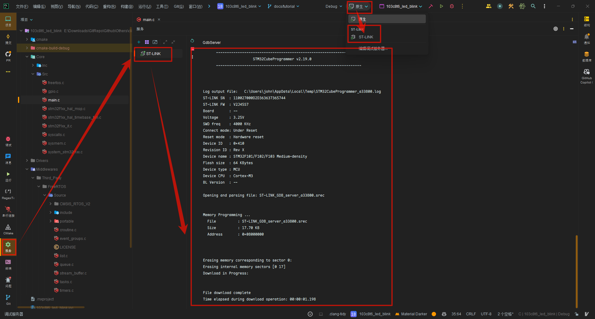

将调试服务器从 `Native` 切换到 `ST-LINK` 之后，便可直接烧录和调试。调试服务器的输出可以通过右端工具栏中的**服务**选项查看，通过输出信息我们可以看出这里正是使用了我们配置的 STM32CubeProgrammer。


