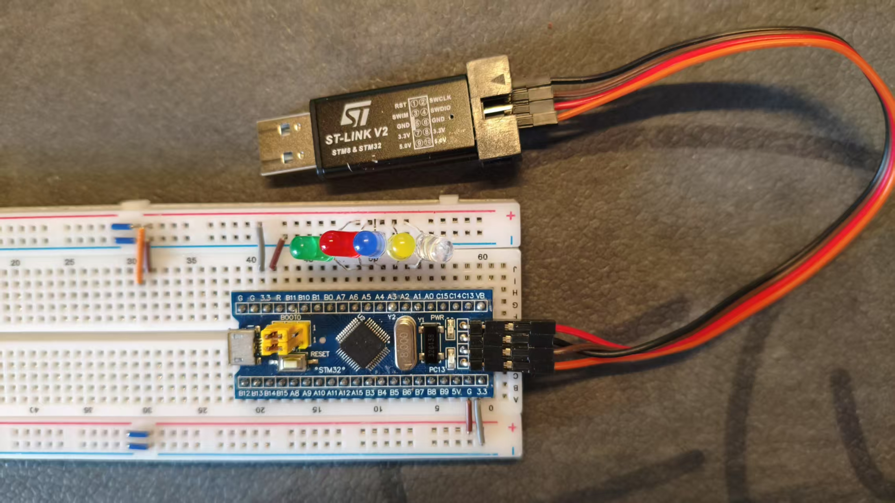

# CLion 配置演示例程

## 简介

本项目是一个 CLion 的配置演示例程，主要用于展示如何在 CLion 中配置 STM32 项目。

## BOM

| 器材                  | 数量 |
|---------------------|----|
| STM32F103C8T6 最小系统板 | 1  |
| 面包板                 | 1  |
| LED                 | 5  |
| MINI ST-LINK V2     | 1  |
| 母对母杜邦线              | 4  |

## 接线图

### 说明

LED 与 GPIO 引脚连接方式如下：

| LED    | GPIO |
|--------|------|
| White  | PA2  |
| Yellow | PA3  |
| Blue   | PA4  |
| Red    | PA5  |
| Green  | PA6  |

>[!important]
> 确保 ST-LINK 工作正常，连接正确。可以使用 ST-LINK Utility 进行测试。

## 代码说明

项目主体使用 STM32CubeMX 生成，其中 FreeRTOS 配置使用 CMSIS_V2 标准。

在 STM32CubeMX 中配置了 5 个任务：
+ `vLedBlinkWhite`：以 10 Hz 频率闪烁白色 LED
+ `vLedBlinkYellow`：以 20 Hz 频率闪烁黄色 LED
+ `vLedBlinkBlue`：以 30 Hz 频率闪烁蓝色 LED
+ `vLedBlinkRed`：以 40 Hz 频率闪烁红色 LED
+ `vLedBlinkGreen`：以 50 Hz 频率闪烁绿色 LED

>[!important]
> 这 5 个任务均实现在 `main.c` 中。其余文件均为 STM32CubeMX 生成的文件，作者并未修改。
